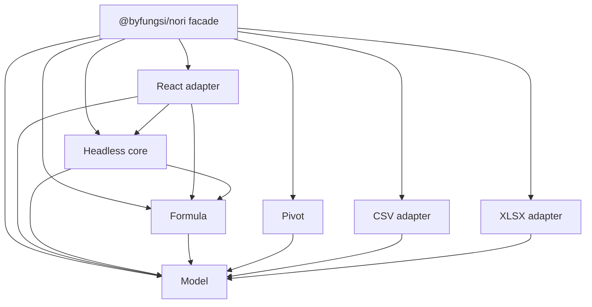

# Architecture

Arrows are allowed source dependencies, not a claim that the root export loads React. The root facade exports only model, XLSX, and runtime APIs. Only `/react` exports the renderer. A boundary checker enforces the graph; a packed-consumer bundler test verifies runtime isolation.

## Owners and boundary decisions

This is a new repository, with no existing owners to extend. Each package has a separate reason to change:

- **Model** owns versioned, sparse, serializable `WorkbookSnapshot` data and validation. Removing this boundary would make parser output and runtime state drift apart. Zod refines and copies external data, brands `SheetId`, and freezes nested snapshot structures. Coordinates remain zero-based indexes, and sparse keys are canonical A1 strings. Version 1 is the only accepted version.
- **XLSX** owns ZIP and XML mechanics. `fflate` and `fast-xml-parser` remain private implementation dependencies. Its public result contains only a canonical snapshot and semantic import warnings. It accepts bytes, never paths, `File`, XML nodes, ZIP entries, or browser APIs. Removing this adapter would leak file-format decisions into every renderer and runtime.
- **Core** owns mutable runtime state behind the `Workbook` interface: atomic command commits, immutable revisions, history, listeners, active sheet, selection, calculation caches, and the dependency graph. The snapshot does not contain any of these services. Renderers cannot mutate the model directly. A separate store facade was considered but adds forwarding without new ownership, so `Workbook` itself is the store.
- **Formula** owns pure parsing/evaluation and registry contracts. It resolves references through a supplied callback contract, so it does not depend on core or OOXML. ASTs retain absolute-reference flags. Results distinguish scalars from arrays. This boundary permits formula evaluation outside a spreadsheet and future alternative runtimes.
- **Pivot** owns semantic field grouping and measures; the host supplies records and renders results. It does not know about cells, UI widgets, XLSX pivot caches, or React. Keeping it independent allows use on native platforms and server data.
- **React** owns DOM, React subscription lifetimes, interaction translation, and CSS mapping. It subscribes through `useSyncExternalStore`, translates edits into commands, and leaves calculation/state ownership in core. A future React Native adapter can consume the same runtime and model.
- **Facade** is the intentional public re-export boundary. Private packages are bundled into its ESM distribution and declaration files. External runtime dependencies remain declared in its manifest; no private workspace package needs publishing.

## Mutation and history

Commands include `setCell`, `clearCell`, `renameSheet`, `resizeColumn`, `resizeRow`, `mergeCells`, `unmergeCells`, and atomic batches. Commands build a candidate snapshot and validate it before any state is committed. Invalid batches produce no partial changes, notifications, or history entries. Successful batches create one history entry and one revision notification. Mutating after undo clears redo. History is bounded to 100 entries by default and can be disabled with `historyLimit: 0`.

Active-sheet and selection changes are transient state, do not enter document history, and are not exported. Selection coordinates are copied and bounds-checked. State retains a stable anchor, a moving focus, and the normalized rectangle expanded over whole merged regions. Pointer gestures are owned by React; selection extension, navigation and merge closure are platform-neutral. Sheet renaming is currently rejected when any formulas exist, because safe formula rewriting has not shipped. Sheet insertion/deletion/reorder are not implemented.

History keeps immutable snapshots, which favors correctness and simplicity over large-workbook memory efficiency. Snapshot validation and copying are O(stored cells) per command. Command inverses and structural sharing are planned.

## Calculation

Core parses formula text into ASTs and constructs a forward/reverse dependency index after each atomic edit or history transition. Ranges expand into edges up to 100,000 cells. Values are evaluated lazily and memoized per workbook revision. A visiting set detects cycles. Cross-sheet names resolve case-insensitively. Blank references return null; arithmetic treats blanks as zero. Missing sheets return `#REF!`.

This first milestone deliberately rebuilds the graph and invalidates all cached values on document edits. `DependencyGraph.affectedBy` provides the tested traversal needed for incremental recalculation, but incremental scheduling is not yet connected. Transient selection changes preserve calculation caches. Range evaluation is capped at 100,000 cells, dependency depth at 256, expression nesting at 128, and formula length at 8192 characters. Over-budget evaluation returns `#NUM!`; over-budget syntax returns a parse error.

Arrays are evaluation results, not mutations. Reading a range returns a rectangular array; using that array in a scalar binary operator currently returns `#VALUE!`. There is no spill allocation or implicit intersection. Exported snapshots retain imported/command-provided cached values; authoritative current values come from `getCellValue`. Export is canonical JSON, not an XLSX writer.

## Host adapters and React Native

Core compiles with `lib: ["ES2022"]`, `types: []`; it has no DOM, Node, filesystem, browser-worker, or timer assumptions. The demo is the browser composition root and converts `File.arrayBuffer()` to bytes. A native host can provide bytes and use the same parser/runtime. File access, asynchronous scheduling, cancellation, platform text measurement, and workers belong in adapters. The synchronous parser should be scheduled outside latency-sensitive UI work for larger files. React Native binding, Metro packaging, and device performance have not been verified.

## Known tradeoffs

This implementation uses a small Result union rather than introducing a full effect runtime. Expected boundary/command failures are typed values; internal invariants may throw. Custom formula functions are application-supplied pure functions; defects thrown by them or subscription listeners propagate to the host. One listener throwing can prevent later listeners from being called, after state is already committed. Neither callbacks nor malformed hand-constructed ASTs are treated as untrusted data; public text/snapshot parsers are the supported trust boundaries.

### Declaration portability decision

Public canonical contracts are plain TypeScript interfaces, structurally checked against each private Zod schema using `satisfies z.ZodType<DomainType>`. This is a deliberate exception to deriving public types directly from schemas: the isolated consumer check found that inferred Zod declaration types exposed a `URL` ambient type requirement to headless consumers. Keeping validation implementation types private removes that platform leakage and shrinks the public declarations. The domain brand is local to Nori; a length-checked schema transform is its only cast. Future schema changes must preserve the structural checks and packed-consumer test.

## Document layout and read-only views

Optional version-1 snapshot fields carry dimension defaults/overrides, merged rectangles, frozen leading row/column counts, hidden indexes, filter criteria, and saved sort metadata. Older snapshots remain valid. Covered merged cells must have null values and no formulas; style-only cells are allowed. Only the top-left cell holds content. Set/clear commands targeting a covered cell address edit the merge anchor, while formula references to covered cells remain blank. Merge commands never silently delete non-anchor content. Unmerge preserves the anchor and styles, and all layout commands support history and serialization.

The renderer sets real column widths and row heights, clips cell content, and applies wrap metadata. Sticky frozen cells use sums of visible dimensions. Merges are projected into the rendered window, so a merge whose anchor is outside that window still displays its anchor value. Merges crossing a freeze boundary move as one unit on that axis, rather than being split into multiple independent cells.

`getVisibleRows`, `getVisibleColumns`, `isRowVisible`, and `isColumnVisible` are headless view operations. They retain original sheet coordinates while excluding hidden/filtered entries. Saved sort metadata describes the order already physically stored in an XLSX: import does not re-sort values or rewrite formulas. The editor shows sort/filter indicators. A read-only `SpreadsheetPreview` subscribes to this same runtime but keeps its tab state local; it never calls runtime mutation/selection methods.

The CSV adapter depends only on the model. It accepts decoded text, preserves quoted fields, and returns a one-sheet snapshot. Value inference is explicit and never creates formulas. File decoding remains in the host adapter.
